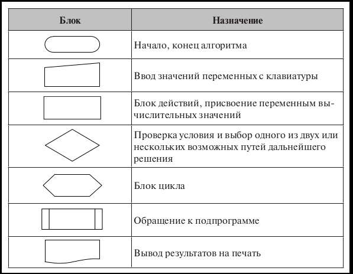
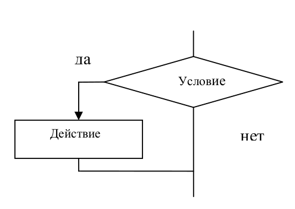
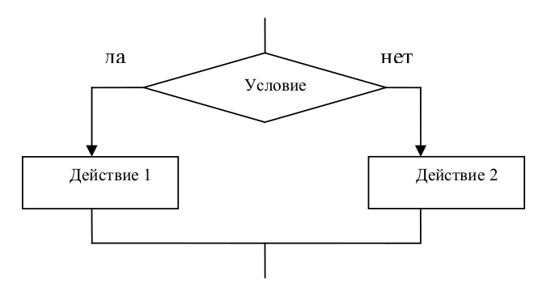
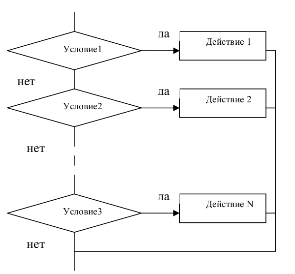
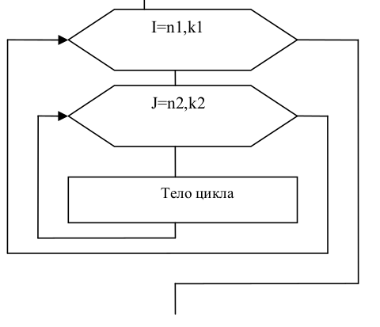

Основы алгоритмизации
=====================

Алгоритм и свойства алгоритма
-----------------------------

:Алгоритм: точное предписание, которое задается вычислительному процессу и представляет собой конечную последовательность обычных элементарных действий, четко определяющую процесс преобразования исходных данных в искомый результат

Свойства алгоритма
""""""""""""""""""
* **Конечность**. Должен заканчиваться за конечное число шагов.
* **Элементарность (понятность)**. Каждый шаг алгоритма должен быть простым, чтобы устройство, выполняющее операции,могло выполнить его одним действием
* **Дискретность**. Процесс решения задачи представляется конечной последовательностью отдельных шагов, и каждый шаг алгоритма выполняется за конечное (не обязательно единичное) время.
* **Детерминированность (определенность)**. Каждый шаг алгоритма должен быть однозначно и недвусмысленно определен и не должен допускать произвольной трактовки. После каждого шага либо указывается, какой шаг делать дальше, либо дается команда остановки, после чего работа алгоритма считается законченной.
* **Результативность**. Алгоритм имеет некоторое число входных величин — аргументов. Цель выполнения алгоритма состоит в получении конкретного результата, имеющего отношение к исходным данным.
* **Массовость**. Алгоритм должен быть применим для некоторого класса задач, различающихся лишь исходными данными.
* **Эффективность**. Необходимо приводить алгоритм к состоянию, чтобы он состоял из минимального числа шагов и при этом решение удовлетворяло бы условию точности и требовало минимальных затрат других ресурсов.

Типы алгоритмических моделей
""""""""""""""""""""""""""""
#. Вычислительный алгоритм
#. Устройство, выполняющее примитивные операции
#. Формальные алгоритмы

Запись алгоритма на некотором языке представляет собой программу. Если программа написана на специальном алгоритмическом языке (например, на ПАСКАЛе или С++), то говорят об исходной программе. Программа, написанная на языке, который непосредственно понимает компьютер (как правило, это двоичные коды), называется машинной, или двоичной.

Основные способы записи алгоритмов
""""""""""""""""""""""""""""""""""
* вербальный  —  алгоритм  описывается  на  человеческом  языке;
* символьный — алгоритм описывается с помощью набора символов;
* графический — алгоритм описывается с помощью набора графических изображений.
При графическом представлении алгоритм изображается в виде последовательности связанных между собой функциональных блоков, каждый из которых соответствует выполнению одного или нескольких действий.
Такое графическое представление называется схемой алгоритма или блок-схемой. В блок-схеме каждому типу действий (вводу исходных данных, вычислению значений выражений, проверке условий, управлению повторением действий, окончанию обработки и т. п.) соответствует геометрическая фигура. Блоки соединяются линиями переходов, определяющими очередность выполнения действий.
**Основные блоки**

       
Базовые алгоритмические структуры
~~~~~~~~~~~~~~~~~~~~~~~~~~~~~~~~~
Алгоритмы можно представлять как некоторые структуры, состоящие из отдельных базовых элементов. Логическая структура любого алгоритма может быть представлена комбинацией трех базовых структур: следование, ветвление, цикл.
Характерной особенностью базовых структур является наличие в них одного входа и одного выхода.

Следование – действия выполняются строго в том порядке, в котором записаны. Образуется последовательностью действий, следующих одно за другим.

       
Ветвление
.........

:Ветвление: Форма организации действий, при которой в зависимости от справедливости проверяемого условия алгоритм может пойти по одной из двух возможных ветвей. Происходит выбор одного из альтернативных путей работы алгоритма. Каждый из путей ведет к общему выходу, так что работа алгоритма будет продолжаться независимо от того, какой путь будет выбран

1) **Неполная форма ветвления (если...то, if...then)**

2) **Полная форма ветвления (если...то...иначе, if...then...else)**

       
3) **Выбор (select case)**

       
Цикл
....

:Цикл: Форма организации действий, при которой одна и та же последовательность шагов алгоритма выполняется несколько раз или ни разу в зависимости от проверяемого условия
1) **Цикл с параметром (for)** – тело цикла выполняется для всех значений некоторой переменной (*параметра* цикла) в заданном диапазоне;

.. figure:: 01_for.png
       :scale: 100 %
       :align: center
       :alt: asda

2) **Цикл с предусловием (while)** – тело цикла выполняется до тех пор, пока выполняется условие;

.. figure:: 01_while.png
       :scale: 100 %
       :align: center
       :alt: asda

3) **Цикл с постусловием (repeat...until)** – тело цикла выполняется до тех пор, пока условие **не** выполняется;

.. figure:: 01_until.png
       :scale: 100 %
       :align: center
       :alt: asda
       
4) **Вложенные циклы**

Возможны случаи, когда внутри тела цикла необходимо повторять некоторую последовательность операторов, т. е. организовать внутренний цикл. Глубина вложения циклов (то есть количество вложенных друг в друга циклов) может быть различной. 

.. note:: При использовании такой структуры необходимо помнить, что параметр внутреннего цикла меняется быстрее параметра внешнего, при одном значении параметра внешнего цикла параметр внутреннего пробегает все свои возможные значения

       
Данные и величины
"""""""""""""""""

В программировании изучаются методы программного управления работой компьютера, который выступает в качестве исполнителя. Компьютер работает с величинами — различными информационными объектами: числами, символами, кодами и др., поэтому алгоритмы, предназначенные для управления компьютером, называются алгоритмами работы с величинами.

:Данные: Совокупность величин, с которыми работает компьютер.

По отношению к программе различают исходные, окончательные (результаты) и промежуточные данные, которые получают в процессе вычислений.
Величина имеет три основных свойства: **имя, значение и тип**. На уровне команд процессора величина идентифицируется при помощи адреса ячейки памяти, в которой она хранится. В алгоритмах и языках программирования величины делятся на *константы и переменные* 
**Костанта** — неизменная величина, и в алгоритме она представляется собственным значением, например: 15, 34.7, k, true и т.д. 
**Переменная** может изменять свои значения в ходе выполнения программы и представляется символическим именем — **идентификатором**, например: X, S2, cod 15. 

Тип данных
~~~~~~~~~~

:Тип данных: определяет множество значений, которые может принимать переменная и множество допустимых операций

В любой язык входит минимально необходимый набор основных типов данных, к которому относятся: *целый, вещественный, логический и символьный* типы 
